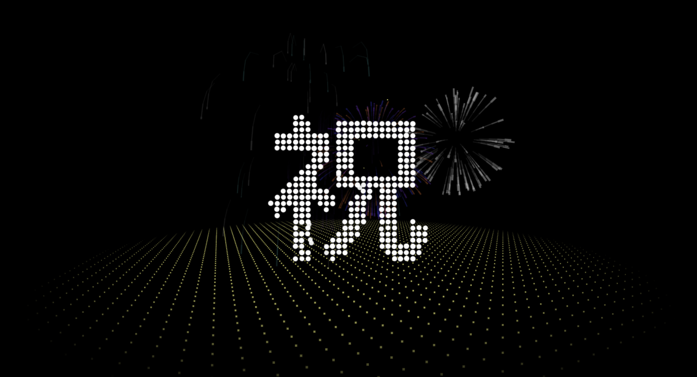
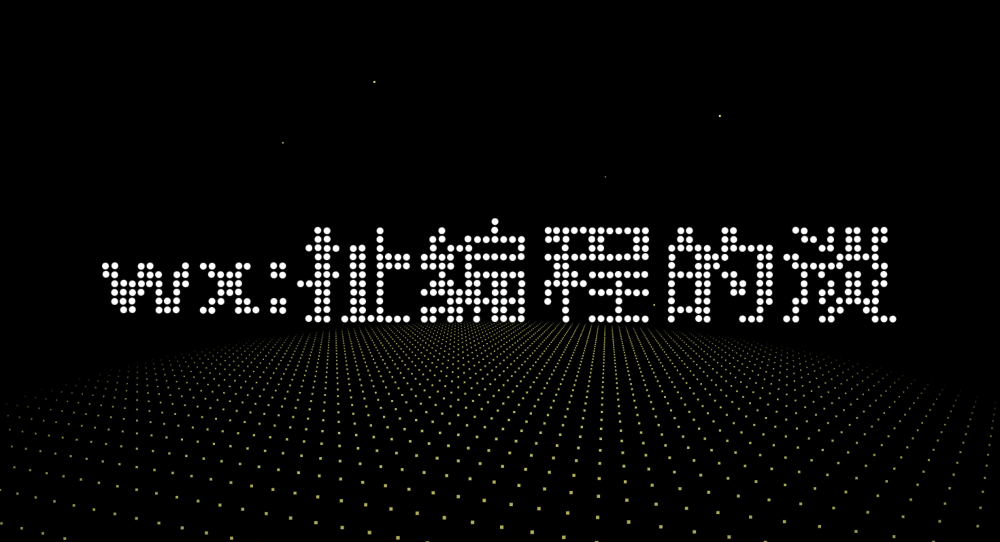

# fireworks

> HTML5+Canvas漂亮的3D烟花动画生日特效，节日特效，烟花

动态效果



静态效果



### 如何自定义内容？

修改js/index.js，中第27行代码

```js
S.UI.simulate('|#countdown 3|xxx|yyy|祝|你|生|日|快|乐|zzz');
```

1）`xxx`和`yyy`可以改为具体的姓名，也可以增加内容，但是一定要用`|`分割

2）最后一直显示的内容为`zzz`，可以自定义一个内容

比如：

```js
S.UI.simulate('|#countdown 3|闫|同|学|祝|你|新|年|快|乐|wx:扯编程的淡');
```
